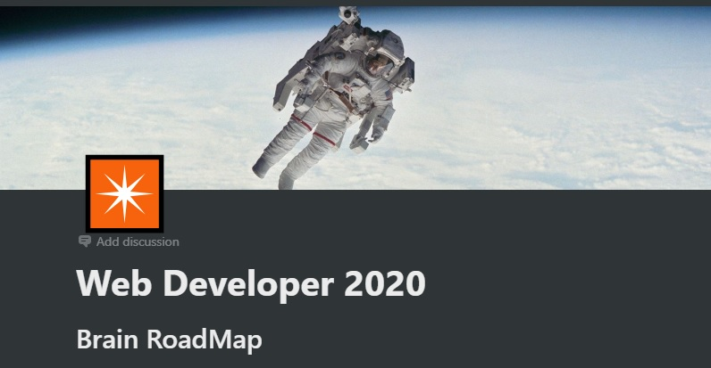

Building...

here i will report all the steps i'm taking to evolve as a programmer.

Road Map - web devoloper 2020 
https://github.com/kamranahmedse/developer-roadmap

I based on learning the basics described in this roadmap, before making the decision in which I will specialize.

# Courses and learning checklist: 

- Learning path
    - [x]  [Git - version control](https://git-scm.com/book/pt-br/v2/Fundamentos-de-Git-Obtendo-um-Reposit%C3%B3rio-Git)
    - [x]  [Basic Terminal usage](https://www.notion.so/vssartori/Comandos-Basicos-prompt-16c92043556446ddbe8c4c680f346b22)
    - [x]  github
    - [x]  licenses
    - [x]  semantic versioning
    - [x]  [SSH](https://www.youtube.com/watch?v=1KLeyQfuxc0)
    - [x]  HTTP/HTTPS and APIS
    - [x]  Design Patterns
    - [ ]  Character Encodings
    - [ ]  State Machines
    - [ ]  [Formal Language Theory](https://en.wikipedia.org/wiki/Formal_language)
    - [ ]  [Computability theory](https://en.wikipedia.org/wiki/Computability_theory)
    - [ ]  [Finite State Machine](https://en.wikipedia.org/wiki/Finite-state_machine)
    - [x]  Algorithms
    - [ ]  [Big O Notation](https://en.wikipedia.org/wiki/Big_O_notation)
    - [ ]  Databases
    - [ ]  [SQL Básico ao Avançado 2019](https://www.youtube.com/watch?v=FNV7_9QsCok&list=PLnNURxKyyLIInBfeGiJ8L314AD015mHkv)
    - [ ]  [SQL microsoft](https://docs.microsoft.com/en-us/learn/browse/?products=sql-server)
    - [x]  [DSA Python](https://www.datascienceacademy.com.br/course?courseid=python-fundamentos)
    - [x]  [Scrimba](https://scrimba.com/p/pNpZMAB/c9Bv3wc8)
    - [x]  Django basic
    - [ ]  [Freecodecamp](https://www.freecodecamp.org/learn/#_=_)
    - [ ]  [CS50's Introduction to computer science](https://cs50.harvard.edu/college/2020/spring/weeks/0/)
    - [ ]  [Introduction to Cloud identity](https://www.coursera.org/learn/cloud-identity/home/welcome)
    - [ ]  [Rest API](https://www.youtube.com/watch?v=qVTAB8Z2VmA&list=PLsyeobzWxl7ps4Z1C4VMtvZEx5-PgyoYI)
    - [x]  [Django 3 - Full stack Website with python](https://www.udemy.com/course/django-3-make-websites-with-python-tutorial-beginner-learn-bootstrap/)
    
    
